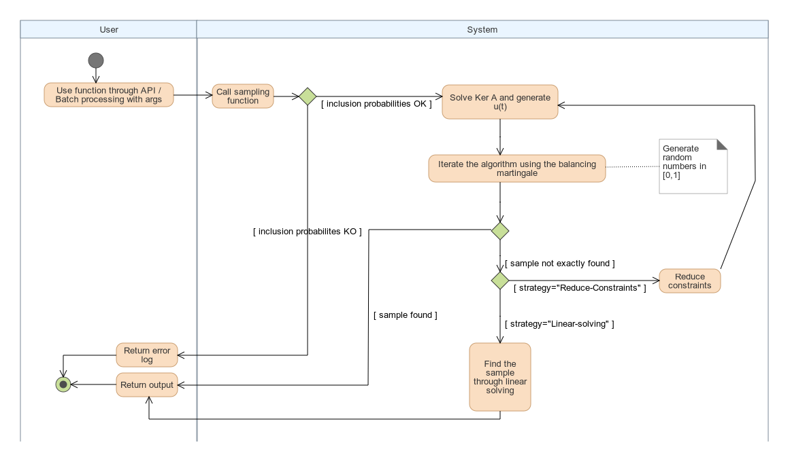

# Balanced cube sampling

Native implementation of cube algorithm in java.

:construction_worker: This is currently in work in progress  :construction_worker:

## Algorithm spec

http://www.math.helsinki.fi/msm/banocoss/Deville_Tille_2004.pdf
Statistic specification

## Algorithm development

<div style="background-color:white">

</div>

Steps description below : 

### Interface
Done :white_check_mark:
### Linear system solving
Gauss Jordan elimination module. :white_check_mark:
### Self balancing Martingale
wip :heavy_multiplication_x:
### Optimisation 
WIP :heavy_multiplication_x:

## How to run the code

Clone the repo and run it with :

```
mvn spring-boot:run
```

